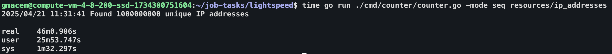
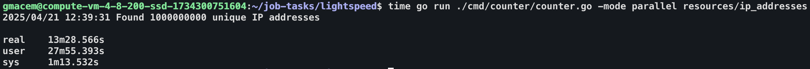

# IP Address Counter Implementation

This project implements an efficient solution for counting unique IPv4 addresses in large files (100GB+). The implementation evolved through several optimization stages to achieve minimal memory usage and maximum processing speed.

## Implementation Evolution

### Stage 1: Bitmap-based Storage

The first major optimization replaced a traditional hash table approach with a bitmap implementation for storing unique IP addresses:

- **Memory Efficiency**: Each IPv4 address is converted to uint32 and mapped to a single bit in the bitmap
- **Optimal Bitmap Size**: Uses 512MB (2^29 bytes) to track all possible IPv4 addresses
- **Fast Bit Operations**: Direct bit manipulation using byte-level operations
- **Constant Memory**: Memory usage stays at 512MB regardless of input size
- **Lookup Speed**: O(1) complexity for checking address existence using bit operations

### Stage 2: Parallel Processing with Windows

The implementation divides large files into processable windows:

1. File is split into 1GB (2^30 bytes) windows
2. Four parallel worker goroutines process windows simultaneously
3. Each goroutine:
   - Processes a 1GB window independently
   - Maintains batch buffer of 10,000 IPs
   - Converts IP strings to uint32 format
   - Sends processed batches to result queue

Benefits of this approach:
- **Parallel Processing**: Multiple 1GB windows processed simultaneously
- **Memory Efficiency**: Each window processed independently
- **Batch Processing**: IPs processed in batches of 10,000 for better throughput
- **Load Distribution**: Even distribution of work across CPU cores

### Stage 3: Thread-Safe Result Collection

Thread safety achieved through careful queue management:

- Results queue buffered to handle 1000 batches (1000 * 10000 = 10^7 IPs)
- Worker goroutines send processed IP batches to queue
- Main goroutine aggregates results into global bitmap
- No mutex locks on bitmap due to queue-based synchronization
- Error channel for proper error propagation from workers

### Stage 4: Memory-Mapped Files

Optimized I/O using memory mapping:

- **Direct Memory Access**: Each 1GB window mapped directly to memory using mmpa
- **Zero-Copy Reading**: No additional buffers or copying needed
- **OS-Level Caching**: Utilizes operating system's page cache
- **Efficient Processing**: 16-byte overlap between windows to handle IP address boundaries
- **Resource Management**: Proper unmapping after window processing

## Performance Impact

The optimizations provide significant benefits:

1. Memory Usage:
   - Constant 512MB bitmap regardless of input size
   - Efficient window-based processing of 1GB chunks
   - No need for temporary IP storage

2. Processing Speed:
   - Parallel processing of 4 windows simultaneously
   - Batch processing of 10,000 IPs at a time
   - Fast bit operations for unique IP tracking
   - Zero-copy reading through memory mapping

## Implementation Diagrams

### Sequential Processing Mode
Basic sequential processing workflow (baseline approach):

### Parallel Processing Mode
Optimized parallel processing with 4 workers, batch processing, and memory mapping:

The parallel processing mode demonstrates significant performance improvements by combining bitmap storage, parallel window processing, and memory mapping optimizations.
